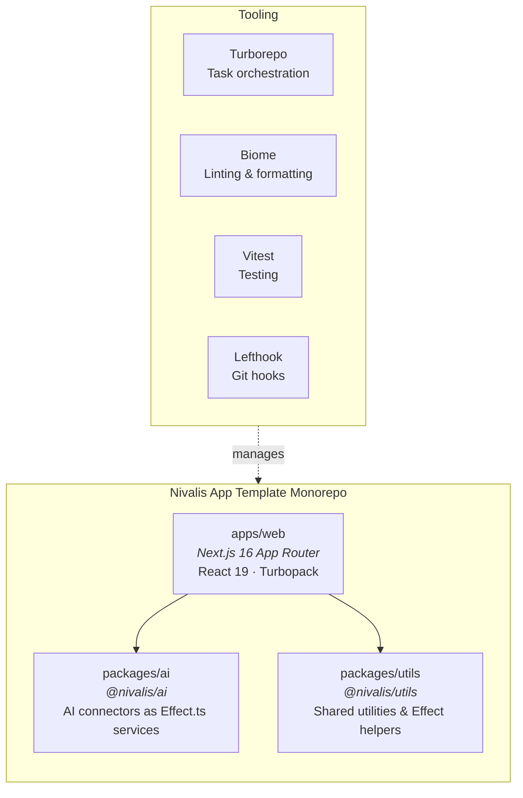
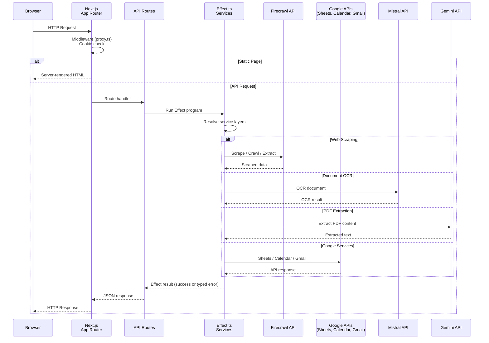
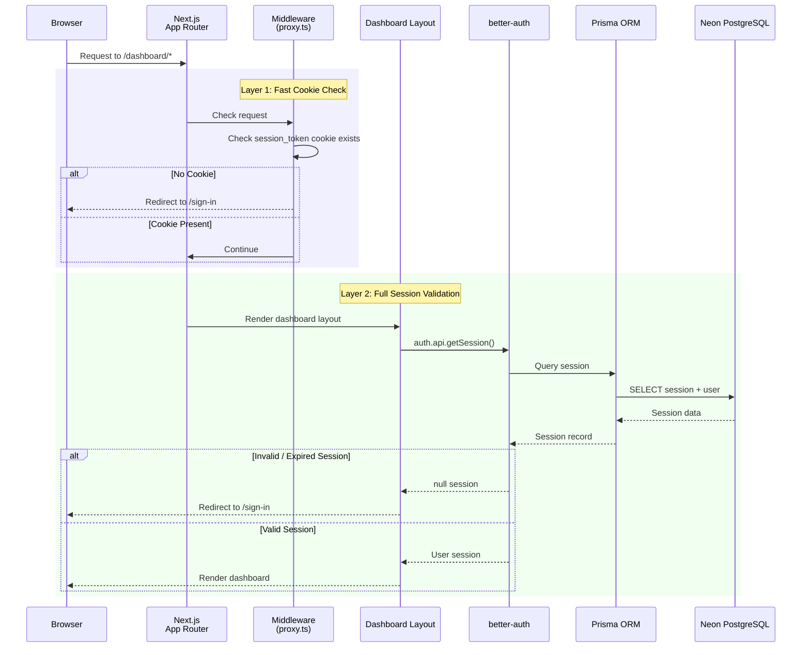

# Architecture

This document describes the high-level architecture of the Nivalis App Template monorepo, including its structure, request flow, and authentication system.

## Monorepo Structure

The repository is organized as a pnpm monorepo with Turborepo for task orchestration. The `apps/web` application depends on two shared packages: `@nivalis/ai` for AI service connectors and `@nivalis/utils` for shared utilities and Effect helpers.

**Key relationships:**

- **`apps/web`** — The Next.js 16 application using App Router with React 19 and Turbopack. Handles routing, rendering, authentication, and API endpoints.
- **`packages/ai`** — Contains AI service connectors built as Effect.ts services: Firecrawl (web scraping), Mistral OCR (document processing), Gemini PDF (PDF extraction), Google Sheets, Google Calendar, and Gmail.
- **`packages/utils`** — Provides shared utilities including Effect error types (`NotFoundError`, `ServiceError`, `ValidationError`, `UnauthorizedError`), layer composition helpers (`composeLayers`, `makeServiceLayer`), and a runtime factory (`makeRuntime`).

## Request Flow

When a user interacts with the application, requests flow from the browser through Next.js to the API routes, which use Effect.ts services to communicate with external APIs.

**Key points:**

- **Middleware** (`proxy.ts`) performs a fast cookie existence check for `better-auth.session_token` before protected routes.
- **Effect.ts services** provide typed error handling — each connector defines its own `Data.TaggedError` (e.g., `FirecrawlError`, `GmailError`), enabling exhaustive error matching.
- **Layer composition** — Individual service layers (e.g., `FirecrawlLive`, `GmailLive`) can be composed into `AiToolkitLive` for providing all services at once. Google services share a single `GoogleAuth` layer for OAuth2 token management.
- **Environment config** — API keys are read via `Config.string()` at layer construction time and validated at runtime via Zod schemas in `env.ts`.

## Authentication Flow

Authentication is handled by `better-auth` with a Prisma adapter connected to a Neon PostgreSQL database. The system provides dual-layer route protection for security.

**Dual-layer protection:**

1. **Layer 1 — Middleware** (`proxy.ts`): A fast, lightweight check that verifies the `better-auth.session_token` cookie exists. This catches unauthenticated users early without a database query.
2. **Layer 2 — Dashboard Layout** (`app/dashboard/layout.tsx`): A full server-side session validation via `auth.api.getSession()`, which queries the database through Prisma to verify the session is valid and not expired.

**Infrastructure:**

- **better-auth** — Handles email/password and OAuth authentication flows with session management.
- **Prisma ORM** — Provides the database adapter for better-auth, using the Neon serverless adapter (`@prisma/adapter-neon`).
- **Neon PostgreSQL** — Serverless Postgres database that stores user accounts, sessions, and related auth data.
